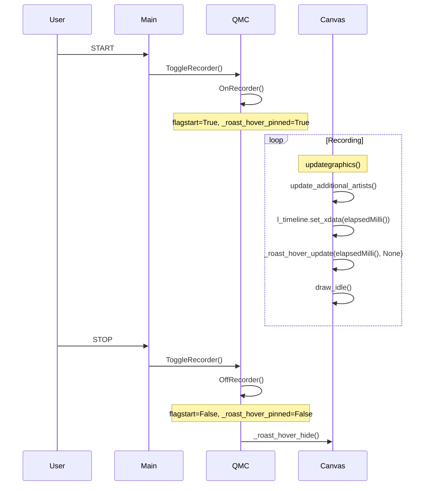

# Pinned bubble во время записи (минимальный план)

## Контекст и потоки данных

- **START:** [main.py](src/artisanlib/main.py) L3216 `buttonSTARTSTOP.clicked` → `qmc.ToggleRecorder` → [canvas.py](src/artisanlib/canvas.py) `ToggleRecorder` (L18074) → `OnRecorder()` (L17894), в конце `self.flagstart = True`.
- **Timeline:** создаётся как `ax.axvline(self.timeclock.elapsedMilli(), ...)` (L14959), обновляется в `update_additional_artists()` (L6511–6514): `set_xdata([self.timeclock.elapsedMilli()] ...)`, `draw_artist(l_timeline)`. Время в **секундах** ([time.py](src/artisanlib/time.py) `elapsedMilli()` = `elapsed()/1000`).
- **Hover сейчас:** только из `onmove()` (L5797+) → `_roast_hover_update(t_sec, event)` (L5266+), строки из `build_hover_bubble_lines(t_sec)` (L5284).
- **BG controls:** кэш `_bg_E1_timex`/`_bg_E1_values` … `_bg_E4_*` (L13420–13523); значение «на момент t» через `_bg_value_at('control_i', t)` → `bg_step_value(tx, vals, t)` (L4967–4991).

---

## A) Флаг pinned и где его включать/выключать

- **Ввести атрибут:** в [canvas.py](src/artisanlib/canvas.py) в `__slots__` (около L738) и в инициализации (рядом с L1697) добавить `self._roast_hover_pinned: bool = False`.
- **Включать:** в `OnRecorder()` (L17894), сразу после `self.flagstart = True` (L17921): `self._roast_hover_pinned = True`.
- **Выключать:** в `OffRecorder()` (L18002), сразу после `self.flagstart = False` (L18017): `self._roast_hover_pinned = False`. Затем вызвать `self._roast_hover_hide()`, чтобы bubble не оставался на экране в последней позиции (и при следующем движении мыши hover будет вести себя как обычно).

---

## B) Отключение обновления bubble из onmove при записи

- **Файл/функция:** [canvas.py](src/artisanlib/canvas.py), `onmove()` (L5797).
- **Место:** в ветке «roast_layout_like и in_roast_axes» (после проверки in_roast_axes, до вычисления `t_sec` по event — до L5846).
- **Правка:** в начале этой ветки добавить условие: если `self.flagstart` и `getattr(self, '_roast_hover_pinned', False)`, то **не** вычислять `t_sec` по событию и **не** вызывать `_roast_hover_update(t_sec, event)`. Варианты:
  - **Вариант 1 (рекомендуемый):** если `self._roast_hover_pinned`, сразу `return` (без вызова hide), чтобы bubble оставался в том состоянии, в котором его обновил `update_additional_artists()`.
  - **Вариант 2:** если `self._roast_hover_pinned`, вызвать `_roast_hover_hide()` и `return` — тогда при движении мыши во время записи bubble будет скрываться; по ТЗ bubble должен быть привязан к timeline и не двигаться, поэтому предпочтителен вариант 1.

Итог: при `_roast_hover_pinned` в этой ветке делать ранний return, не вызывая `_roast_hover_update` и не трогая bubble.

---

## C) Где обновлять pinned bubble в реальном времени

- **Место:** [canvas.py](src/artisanlib/canvas.py), `update_additional_artists()` (L6509+), **сразу после** блока с `l_timeline` (после L6514).
- **Условие:** `if self.ax is not None and self.flagstart and getattr(self, '_roast_hover_pinned', False):`
- **Действия:**
  1. `t_sec = self.timeclock.elapsedMilli()` (текущее время записи в секундах).
  2. Вызвать `self._roast_hover_update(t_sec, event=None)` (режим pinned будет определяться внутри по `_roast_hover_pinned` или по `event is None`).
  3. Вызвать `self.fig.canvas.draw_idle()`, чтобы обновлённый bubble и vline отрисовались (без этого при следующем цикле отрисовки состояние может быть устаревшим).

**Blit:** В коде при `roast_layout_like` используется ветка без blit (L7792–7796: `updateBackground()` + `update_additional_artists()`), т.е. полная перерисовка. В ветке с blit (L7689–7791) вызывается `update_additional_artists()` и затем `blit(axfig.bbox)`; при этом hover-артисты (vline, bubble) сейчас не рисуются через `draw_artist` в этом пути. Ограничить поведение: **pinned bubble включать только при `roast_layout_like**` (в условии в `update_additional_artists()` добавить проверку `getattr(self, 'roast_layout_like', False)`). Тогда при записи в roast-like pinned обновляется и отображается через `draw_idle()`; в classic-пути с blit pinned не включается, регрессий нет.

---

## D) Новые функции (в canvas.py)

**1) `_next_bg_control_changes(self, t_sec: float, max_sec: float = 15) -> list[tuple[float, float, str]]**`

- Возвращает список кортежей `(dt, pct, label)` для напоминаний: «через dt секунд control примет pct%»; только для каналов, у которых следующее изменение в (0, max_sec].
- Реализация: для каждого `ci` в 0..3 взять `tx = getattr(self, f'_bg_E{ci+1}_timex', None)`, `vals = getattr(self, f'_bg_E{ci+1}_values', None)`. Если нет — пропустить. Иначе найти минимальный индекс `i`, такой что `i < len(tx)` и `tx[i] > t_sec` (первый момент в будущем). Если такой есть: `dt = tx[i] - t_sec`; если `0 < dt <= max_sec`, добавить `(dt, float(vals[i]), self.etypesf(ci))`. Собрать по всем четырём каналам, отсортировать по `dt`, оставить до 3 записей (например первые 3 элемента) и вернуть.
- Размещение: рядом с `_bg_value_at` / `bg_step_value` (например после L4997).

**2) `build_pinned_bubble_lines(self, t_sec: float) -> list[tuple[str, str]]**`

- Возвращает `list[(text, color)]` для pinned bubble. **Не трогать** `build_hover_bubble_lines`.
- Порядок строк:
  1. **Time:** `f"Time: {stringfromseconds(t_sec)}"`, цвет `self.palette.get('hoverbubble_time', '#e8e8e8')`.
  2. **Live controls (текущие значения с активных линий):** только control_0..3 — через ту же логику, что и в hover (чтение с `ax_controls.lines`, `_control_line_value_at(line, t_sec)` для линий E1–E4), цвет из `line.get_color()` / `_hover_color_to_hex`. Если линии нет или значения нет — не добавлять строку для этого канала.
  3. **BG controls:** только если есть background (например `self.background and self.backgroundprofile is not None and len(self.timeB) > 0`). Для каждого `raw_key in ('control_0', 'control_1', 'control_2', 'control_3')` проверить `bg_enabled_for_raw_key(raw_key)`, вызвать `_bg_value_at(raw_key, t_bg)` с `t_bg = clamp(t_sec, timeB[0], timeB[-1])`; если не None — добавить строку вида `('BG ' + suffix, color)`.
  4. **Reminders:** только при наличии background и кэша `_bg_E*_timex`. Вызвать `_next_bg_control_changes(t_sec, max_sec=15)`, для каждого `(dt, pct, label)` добавить строку `(f"In {int(round(dt))}s: {label} {int(round(pct))}%", color)` (цвет, например, из палитры или фиксированный для напоминаний). Ограничить максимум 3 напоминания (уже в `_next_bg_control_changes` возвращать не более 3).
- Размещение: рядом с `build_hover_bubble_lines` (после L5265).

---

## E) Изменения в _roast_hover_update

- **Файл:** [canvas.py](src/artisanlib/canvas.py), функция `_roast_hover_update(self, t_sec, event=None)` (L5266).
- **Изменения:**
  1. **Режим pinned:** в начале (после проверки `self.ax is None`) определить, что режим pinned: например `pinned = getattr(self, '_roast_hover_pinned', False) or (event is None and self.flagstart)`. Если `pinned`, использовать для контента bubble не `build_hover_bubble_lines(t_sec)`, а `parts_with_colors = self.build_pinned_bubble_lines(t_sec)`.
  2. **y_cursor при event=None:** уже есть логика (L5400–5405): если `event is None` или нет `event.ydata`, то `y_cursor = (ylim[0] + ylim[1]) / 2.0`. Для «панели» near-top: при `pinned` задать, например, `y_cursor = ylim[1] - 0.05 * (ylim[1] - ylim[0])` (чуть ниже верхней границы), чтобы bubble стабильно был у верхней части графика; оформить как отдельную ветку при `pinned`.
  3. Остальное не менять: обновление vline по `t_sec`, обновление TextArea из `parts_with_colors`, позиция `_roast_hover_bbox.xy = (t_sec, y_cursor)`, маркеры по кривым — всё так же; при pinned маркеры можно оставить по тем же правилам (по live controls и, при наличии, BG), либо упростить и не рисовать маркеры в pinned — в плане оставить «без изменений логики маркеров», при необходимости упростить в отдельном шаге.

---

## F) Приёмка (ручные тесты)

1. **Запись Start:** включить запись (START), убедиться, что bubble привязан к пишущей линии (X = текущее время), не двигается при движении мыши по графику; обновляется по времени (Time и live controls меняются с течением времени).
2. **Stop:** нажать STOP; bubble скрывается; при движении мыши снова работает обычный hover (bubble следует за курсором, контент по `build_hover_bubble_lines` и hover_bubble_config).
3. **Без BG:** запись без загруженного background profile; pinned bubble показывает только Time и live controls (Air/Drum/Burner/Power по текущим линиям), без строк BG и без Reminders.
4. **С BG:** запись с загруженным background; pinned показывает Time, live controls, строки BG для control_0..3 и блок Reminders; напоминания только для изменений в ближайшие 15 секунд, формат «In Xs: &lt;ControlName&gt; Y%»; не более 3 напоминаний, отсортированы по dt.
5. **Reminders корректны:** при приближении к моменту изменения BG control значение dt уменьшается, после прохождения момента напоминание исчезает или заменяется следующим; не показывать напоминание, если следующее «изменение» — то же значение (опционально: в `_next_bg_control_changes` можно фильтровать случай, когда `vals[i] == текущее значение на t_sec`, чтобы не показывать «In 2s: Gas 70%» при уже текущих 70%).

---

## Сводка мест вмешательства

| Файл                                  | Место                                            | Действие                                                                                                                                              |
| ------------------------------------- | ------------------------------------------------ | ----------------------------------------------------------------------------------------------------------------------------------------------------- |
| [canvas.py](src/artisanlib/canvas.py) | `__slots__` и инициализация (~L738, ~L1697)      | Добавить `_roast_hover_pinned`.                                                                                                                       |
| [canvas.py](src/artisanlib/canvas.py) | `OnRecorder()` (L17921)                          | После `flagstart = True` установить `_roast_hover_pinned = True`.                                                                                     |
| [canvas.py](src/artisanlib/canvas.py) | `OffRecorder()` (L18017)                         | После `flagstart = False` установить `_roast_hover_pinned = False`, вызвать `_roast_hover_hide()`.                                                    |
| [canvas.py](src/artisanlib/canvas.py) | `onmove()` (в ветке roast_layout_like, до L5846) | При `_roast_hover_pinned` — ранний return, не вызывать `_roast_hover_update`.                                                                         |
| [canvas.py](src/artisanlib/canvas.py) | `update_additional_artists()` (после L6514)      | При `flagstart` и `_roast_hover_pinned` и `roast_layout_like`: `t_sec = timeclock.elapsedMilli()`, `_roast_hover_update(t_sec, None)`, `draw_idle()`. |
| [canvas.py](src/artisanlib/canvas.py) | Новая функция                                    | `_next_bg_control_changes(t_sec, max_sec=15)` → список `(dt, pct, label)`, до 3.                                                                      |
| [canvas.py](src/artisanlib/canvas.py) | Новая функция                                    | `build_pinned_bubble_lines(t_sec)` → Time, live controls, BG control_0..3, reminders.                                                                 |
| [canvas.py](src/artisanlib/canvas.py) | `_roast_hover_update()` (L5266+)                 | При pinned — брать строки из `build_pinned_bubble_lines`; при `event is None`/pinned задать y_cursor near-top.                                        |

Дополнительно: при отсутствии background в `build_pinned_bubble_lines` не вызывать `_bg_value_at` и `_next_bg_control_changes`; reminders показывать только при наличии хотя бы одного `_bg_E*_timex`.